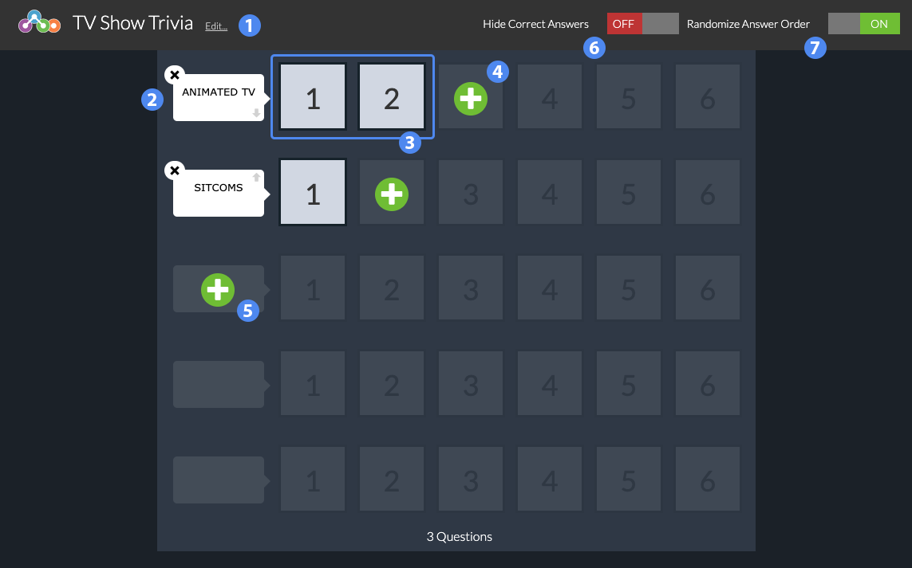
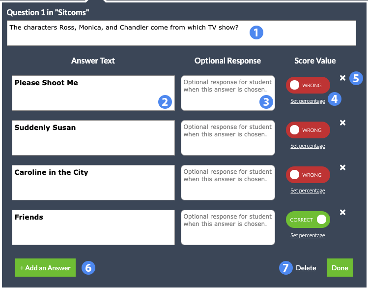

## Overview ##

Enigma is a Jeopardy-like study or quiz tool. Questions are separated into categories. Unlike Jeaopardy, every question in a row is given the same score weight.

1. Title of the widget
2. Category row
3. Questions in category
4. Add a new question
5. Add a new category
6. Toggle to hide correct answers in the score screen
7. Randomize ordering of answers within a question

## Details ##

### Categories ###

Categories can be used to group questions according to similarities in their content or purpose.  Each category can have up to six questions.

### Questions ###

1. Question Text
2. Answer Text
3. Optional feedback for a given answer
4. Score value options
5. Delete Answer
6. Add another answer choice
7. Delete this question

#### Answers ####

Questions must have at least one 100% correct answer, but may have more than one answer choice marked correct. In addition, you can use the **Set percentage** option to assign a percentage score value for the corresponding answer choice.

If the **Randomize Answer Order** check box in the main screen is toggled on, then the order of answer choices within each question will be randomized every time a student plays this widget.

<aside>
	Keep in mind that <strong>Randomize Answer Order</strong> will not affect the order of the questions within a category, only the answers for each question.
</aside>

#### Hide Correct Answers ####

If this option is selected, the correct answer will not be provided on the score screen once a student completes the widget. By default, the score screen will display which answers were incorrect, along with the correct value for each question.

#### Feedback ####

Feedback is purely optional, but may be used to provide helpful information for incorrect answers or additional details for correct answers.
