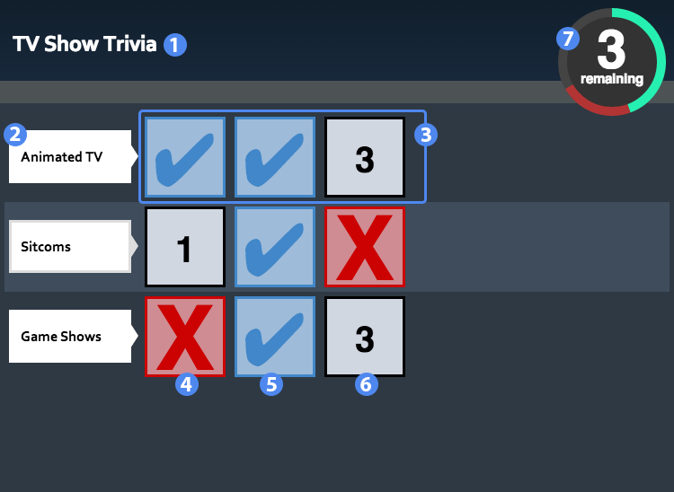
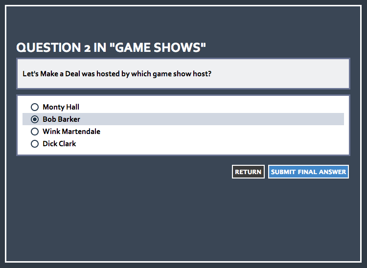

# Overview #

Enigma is a Jeopardy-like study and quiz tool. Question are separated into categorical rows.

## Main Board ##

1. Title of the widget
2. Category name
3. Category questions
4. Question tile, incorrect response given
5. Question tile, correct response given
6. Question tile that has yet to be completed
7. Remaining question indicator

## Details ##

### Gameplay ###

Selecting a question brings up the question screen. Select an answer choice and click "Submit Final Answer" to return to the main board.

### Submitting ###

When all questions are answered you will be prompted to submit your answers. This will take you to the score screen to review your score.
